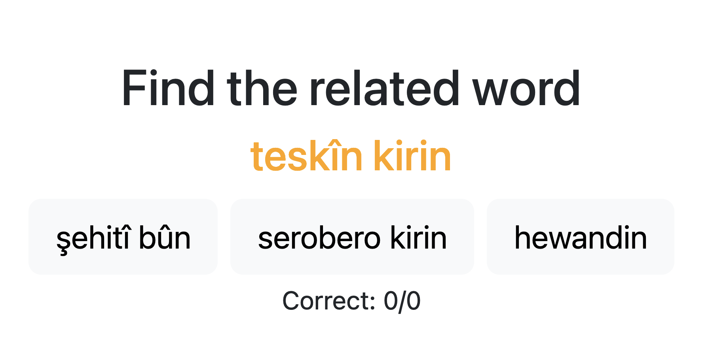
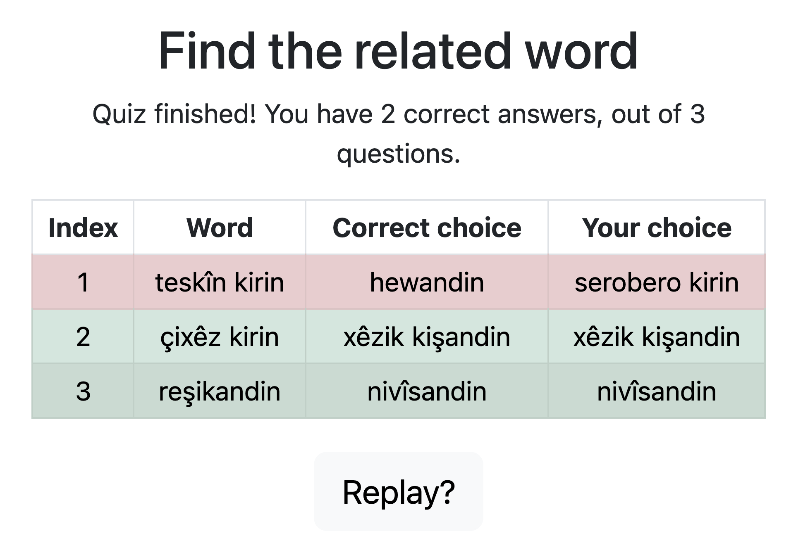

# kurdish-related-quiz

A quiz based on related words in Kurdish.

- Implemented with @kiymetakdemir .

- Lêker (verbs) were gotten from Kurdish Wiktionary.
- The quiz uses GraphDB.
- The large file `ferhengo-ontolex-graph.ttl` should be uploaded to GraphDB.
- In this repository, there are scripts used to get the data from Wiktionary and to convert it to the `ttl` format.

## Gallery

Image at the start of the quiz:

Image at the end of the quiz:

